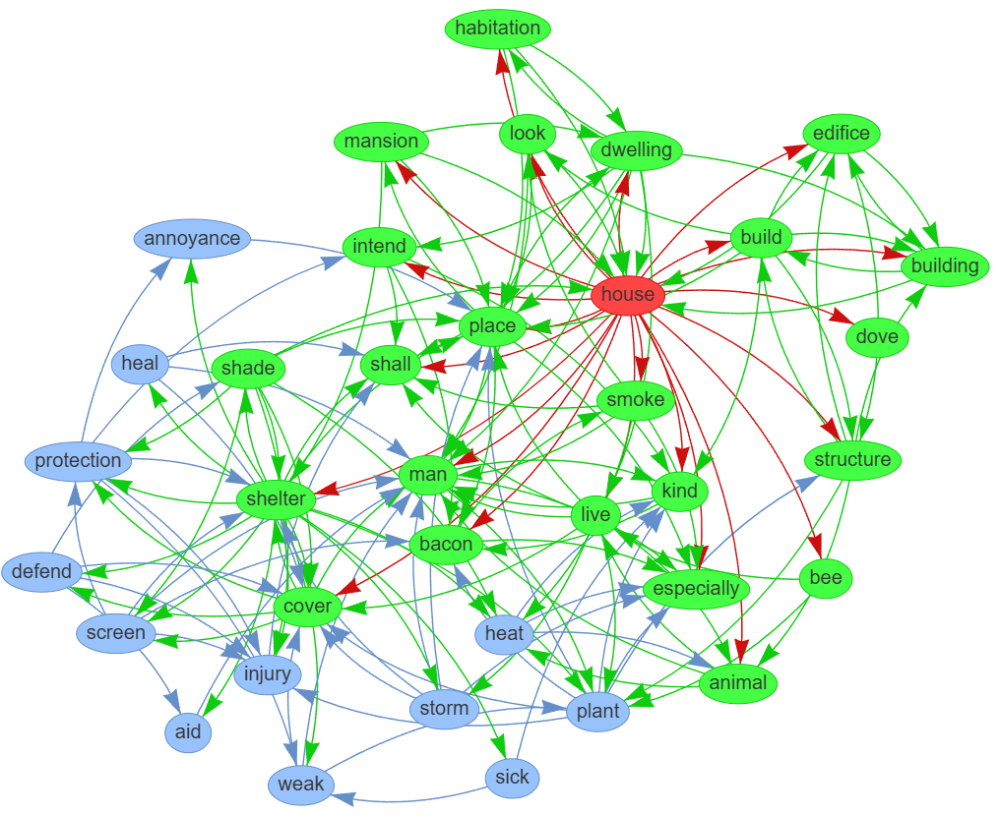

# Dictionary Graph

A Python application that creates and visualizes a graph of word relationships based on dictionary definitions.



## How It Works

This project transforms a traditional dictionary into an interactive knowledge graph by analyzing the relationships between words based on their definitions. Here's the flow of data through the system:

1. **Dictionary Input** (`data/dictionary.json`):
   - Starts with a JSON file containing word-definition pairs
   - Each entry maps a word to its definition text

2. **NLP Processing** (`preprocessing.py`):
   - Processes each definition using spaCy NLP
   - Extracts key words and relationships
   - Identifies parts of speech and word importance
   - Filters out stop words and irrelevant terms

3. **Graph Construction** (`graph.py`):
   - Creates nodes for each dictionary word
   - Establishes edges based on word appearances in definitions
   - Weights connections by word importance
   - Builds a NetworkX graph structure

4. **Visualization Layer** (`visualization.py`):
   - Converts NetworkX graph to vis.js format
   - Applies visual styling and layout algorithms
   - Prepares data for interactive display

5. **Web Interface** (`web/`):
   - Serves the interactive visualization
   - Enables word search and exploration
   - Provides real-time graph navigation
   - Shows word relationships and paths

### Why This Matters

This project demonstrates how we can transform traditional reference materials into interactive knowledge networks. Such transformation offers several benefits:

- **Discover Relationships**: Uncover connections between words that might not be obvious in a traditional dictionary
- **Visual Learning**: See how language concepts relate to each other spatially
- **Semantic Navigation**: Follow paths of meaning through the dictionary
- **Research Tool**: Analyze language patterns and word clusters
- **Educational Aid**: Help students understand word relationships and etymology
- **Content Analysis**: Study how concepts are interconnected in specific domains

The resulting graph becomes a powerful tool for linguistics research, education, and natural language processing applications.

## Project Structure

```
dictionary_graph/
├── data/                      # Data storage
│   └── dictionary.json        # Input dictionary
├── dictionary_graph/          # Main package
│   ├── __init__.py           # Package initialization
│   ├── preprocessing.py       # NLP processing
│   ├── graph.py              # Graph operations
│   ├── visualization.py       # Graph visualization
│   └── web/                  # Web interface
│       ├── __init__.py       # Web package initialization
│       ├── app.py            # Flask application
│       ├── static/           # Static web assets
│       │   ├── script.js     # Core JavaScript
│       │   ├── style.css     # CSS styles
│       │   └── lib/          # Third-party libraries
│       │       ├── bindings/ # Custom graph bindings
│       │       ├── tom-select/# Autocomplete component
│       │       └── vis-9.1.2/# Graph visualization
│       └── templates/        # HTML templates
│           └── index.html    # Main page
├── config.py                 # Configuration settings
├── main.py                   # CLI entry point
├── requirements.txt          # Python dependencies
├── README.md                 # Documentation
└── wsgi.py                  # WSGI server entry point
```

## Prerequisites

- Python 3.8 or higher
- pip package manager
- Sufficient RAM for dictionary processing (recommended: 4GB+)
- Internet connection for initial spaCy model download

## Installation

1. Clone the repository
2. Install dependencies:
   ```bash
   pip install -r requirements.txt
   python -m spacy download en_core_web_sm
   ```

## Input Data Format

The application uses Webster's Unabridged English Dictionary from [matthewreagan/WebstersEnglishDictionary](https://github.com/matthewreagan/WebstersEnglishDictionary). The dictionary file should be placed at `data/dictionary.json` with the following format:

```json
{
    "word1": "definition1",
    "word2": "definition2",
    ...
}
```

Each entry should be a word-definition pair, where the word is the key and its definition is the value.

## Usage

The application has three main modes of operation:

1. Process dictionary data:
   ```bash
   python main.py process
   ```

2. Build the graph:
   ```bash
   python main.py build
   ```

3. Run the development server:
   ```bash
   python main.py serve
   ```

Here's the application in action:


## Production Deployment

For production deployment, use gunicorn with the WSGI entry point:

```bash
gunicorn --bind 127.0.0.1:8000 --workers 4 --timeout 120 wsgi:app
```

Important production considerations:
- Use a reverse proxy (e.g., Nginx) in front of gunicorn
- Set up SSL/TLS encryption
- Configure appropriate firewall rules
- Monitor server resources and logs
- Set up proper user permissions

## Security Features

The application implements several security measures:
- Rate limiting to prevent abuse
- Input validation and sanitization
- Request size limits
- Security headers (CSP, HSTS, etc.)
- Caching to improve performance
- Resource usage limits
- Error handling and logging

## Features

- NLP-based dictionary processing using spaCy
- Graph construction using NetworkX
- Interactive visualization using vis.js
- Web interface for exploring word relationships
- Progress tracking for long operations
- Configurable visualization parameters
- Multiple visualization modes

## Configuration

All configuration settings are in `config.py`. Key settings include:

- File paths and directories
- NLP model settings
- Visualization parameters
- Node colors and sizes
- Flask server settings

## Development

The project is organized into modules:

- `preprocessing.py`: Handles NLP processing of dictionary data
- `graph.py`: Manages graph construction and operations
- `visualization.py`: Creates interactive visualizations
- `web/app.py`: Provides the web interface
- `wsgi.py`: Production server entry point

Each module can be run independently for testing or development purposes.

## Third-Party Libraries

The web interface uses several third-party libraries:
- vis.js (v9.1.2) for graph visualization
- tom-select for search autocomplete
- Custom graph bindings for enhanced interactivity

## Troubleshooting

Common issues and solutions:

1. **Memory Error during processing**:
   - Increase available RAM
   - Reduce dictionary size
   - Adjust batch size in config.py

2. **Slow graph loading**:
   - Reduce graph complexity in config.py
   - Use a more powerful server
   - Enable caching

3. **Missing spaCy model**:
   - Run `python -m spacy download en_core_web_sm`
   - Check internet connection
   - Verify Python environment

4. **Server timeout issues**:
   - Increase gunicorn timeout
   - Optimize graph operations
   - Add request caching